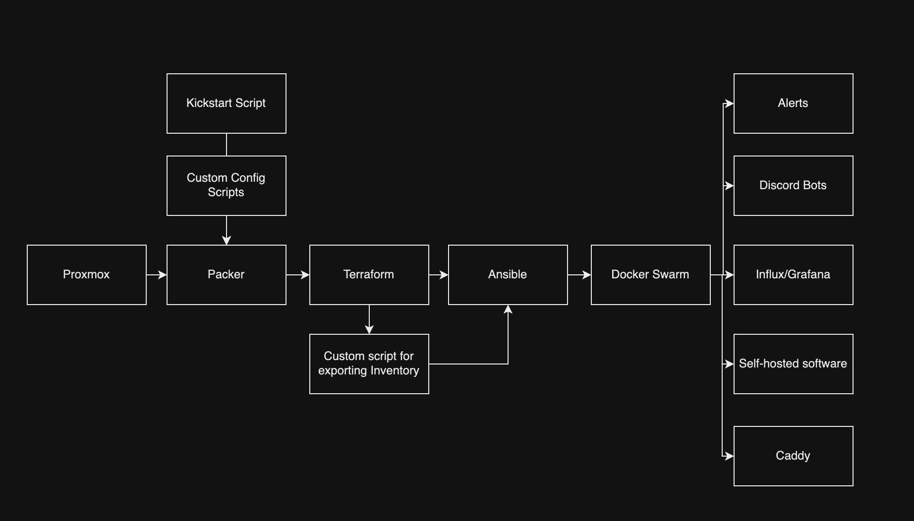
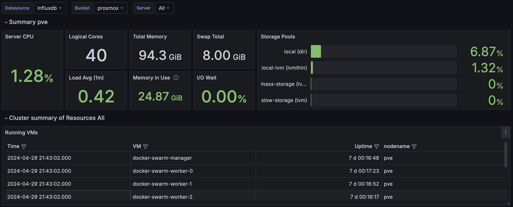

+++
title = 'Peter, where have you been?'
date = 2024-04-29T20:00:00-07:00
draft = false
tags = ['infrastructure', 'homelab']
+++
Hey y’all - it’s been 1,359 days since my last blog post — feels like a lifetime ago! A lot 
has since changed. My wife and I welcomed a beautiful baby boy into our family, marking the beginning of an exciting 
new chapter. Professionally, I have made a leap from front-end development to platform engineering, embracing the vast 
world of DevOps. This journey took an exciting turn about two years ago when I started working at Lucasfilm. The 
experience has been incredibly fulfilling. Fatherhood and navigating new career waters at such a storied company 
have been transformative. However, less about me and more about my homelab!

## Homelab Catastrophe and Rebuild

About a week ago, around April 23, 2024, I decided it was time to upgrade our Proxmox virtualization platform from version 7.1.x to 8.1.x. Proxmox helps manage my homelab's virtual environments, and the latest version would be a peace of mind security-wise (keep your stuff up to date). Before starting, I jokingly told my wife that I should back everything up because there was a real risk of losing data. She gave me that 'I hope you know what you're doing' look that I had seen before. Despite the warning bells, I went ahead. Unfortunately, just an hour later, my fears came true and I lost everything. This mishap reminded me forcefully of the importance of backups, especially when upgrading critical systems.

[](backup_on_the_server.png)

## Rebuilding with Automation

Thus began my project to automate the building of my homelab. In my day job, I frequently utilize tools like Packer, Terraform, and Ansible to manage infrastructure, along with Docker for containerization and setting up for deployments. These experiences encouraged my rationale to automate the creation, configuration, and deployment of virtual machines using these same principles of infrastructure as code. To add an extra layer of sophistication, I decided to integrate Docker Swarm into my setup.
[](homelab-flowchart.png)

## Technical Deep Dive

The first step in my automation project was to select a Linux distribution. Normally, I’d go with the reliable Ubuntu Server LTS, but I wanted to challenge myself and explore new options. I decided on Alma Linux, which I feel like is known for its reliability and enterprise capability, which seemed like a promising new environment to learn. Next, I needed to determine the best method for automating the creation of my Proxmox template. The choices were cloud-init, Packer, or building directly in Proxmox. After some going back and forth with myself and core thinking, I chose Packer for its simplified automation capabilities and versatility in building machine images. Using Packer, I could streamline the setup process and ensure consistency across deployments.

After spending an hour or two tinkering and learning how to craft kickstart scripts for cleaning up the image.
I created some custom shell scripts to not only cleaned up the base image but also populated each machine with pem keys for passwordless authentication — a big requirement for me and a critical step for enhancing security. Additionally, I removed unnecessary components like Podman to streamline the system for my specific needs. The result was a beautiful Proxmox template, ready to serve as the backbone for all my projects.

Below, you’ll find a snippet of the Packer configuration:

```
source "proxmox-iso" "alma_linux" {  
  proxmox_url             = var.proxmox_api_url  
  username                = var.proxmox_user  
  password                = var.proxmox_password  
  node                    = var.proxmox_node  
  iso_file                = var.proxmox_iso_file  
  ssh_username            = var.ssh_username  
  ssh_password            = var.ssh_password
  ssh_timeout             = var.ssh_timeout 
  vm_name                 = var.image_name
  cpu_type                = var.proxmox_cpu_type 
  memory                  = var.proxmox_memory  
  cores                   = var.proxmox_cores  
  vm_id                   = var.proxmox_vm_id  
  http_directory          = "~/Documents/infra/packer/http"  
  boot_command = [  
    "<tab> inst.text inst.ks=http://{{ .HTTPIP }}:{{ .HTTPPort }}/ks.cfg<enter>"  
  ]
}
```

Now that the Packer setup was complete, I moved on to what I consider my specialty: Terraforming. My primary goal with Terraform was efficiency; I needed a tool that could manage the deployment of multiple virtual machines with minimal  coding. This led me directly to Terraform, which proved perfect for quickly setting up about seven VMs for my homelab (more to come in the future)—1 Docker Swarm manager, 3 Docker Swarm workers, and 3 GitHub Action Agents.

The main technical challenge was determining how to automatically generate an Ansible inventory file (`machine_inventory.ini`) from Terraform outputs. Initially, I considered directly writing the outputs to a file, but instead, I wrote a super short and sweet custom shell script that would fetch the output from Terraform, process it, and format it correctly for Ansible.

Below, you’ll find a snippet of the Terraform configuration for a Docker Swarm worker and the Bash script that bridges Terraform outputs to an Ansible inventory:

```
resource "proxmox_vm_qemu" "docker-swarm-worker" {  
  agent       = 1  
  boot        = "order=scsi0;ide2;net0"  
  clone       = var.alma_template  
  count       = var.vm_worker_count  
  cores       = var.docker_swarm_cores  
  cpu         = "x86-64-v2-AES"  
  desc        = "Worker nodes for the Docker Swarm cluster"  
  full_clone  = false  
  kvm         = true  
  memory      = var.docker_swarm_memory  
  name        = "docker-swarm-worker-${count.index}"  
  onboot      = true  
  qemu_os     = "other"  
  scsihw      = "virtio-scsi-single"  
  sockets     = var.docker_swarm_sockets  
  target_node = var.pve_node  
  vcpus       = 0  
  vmid        = 701 + count.index
```
*<sup>Note that this is not the entirety of the terraform file</sup>

```
#!/bin/bash  
  
# Define the path to the Terraform directory  
TERRAFORM_DIR="../terraform/"  # Update this path as needed  
  
# Navigate to the Terraform directory to ensure terraform commands work  
cd "$TERRAFORM_DIR"  
  
# Fetch outputs from Terraform  
manager_name=$(terraform output -json manager_details | jq -r .name)  
manager_ip=$(terraform output -json manager_details | jq -r .ip)  
worker_details=$(terraform output -json worker_details)  
agent_details=$(terraform output -json agent_details)  # Fetch GitHub Action agent details  
  
# Define the path to the inventory file  
INVENTORY_DIR="../ansible/inventory"  # This should be relative to the Terraform directory or absolute  
INVENTORY_FILE="$INVENTORY_DIR/machines.ini"  
  
# Check if the inventory directory exists, create if it doesn't  
mkdir -p "$INVENTORY_DIR"  
  
echo "[github-action-agents]" >> "$INVENTORY_FILE"  
# Add GitHub Action agents to the inventory  
echo "$agent_details" | jq -c '.[]' | while read -r line; do  
  agent_name=$(echo $line | jq -r .name)  
  agent_ip=$(echo $line | jq -r .ip)  
  echo "$agent_name ansible_host=$agent_ip" >> "$INVENTORY_FILE"  
done
```
<sup>Note that this is not the entirety of the script</sup>
This approach not only streamlined the setup but also integrated seamlessly with Ansible, ensuring that all components of my infrastructure were automatically up-to-date and correctly configured -- did I mention that I love Terraform? This was probably the most fun I had with this project.

Next was Ansibilizing and preparing everything to either fit into the docker swarm, do one last round of configuration, or deploy to a machine directly (i only had to do this with my reverse proxy because i originally had it sit on the proxmox machine instead of having it sit on a virtual machine). This was probably the funnest part of the adventure. I've recently been diving into Ansible a lot lately and want to reach a high mastery level. The first part that I needed to overcome was how do i... overcome secrets management? Do I stuff everything into Vault? Do I use Ansible vault? This is just my homelab so I could do plaintext. For this I decided to use Ansible Vault and setup a private key that would unlock all my secrets and make it easier for accessing the secrets. Seeing I populated each VM with an ansible user and provided a PEM key I was able to quickly setup and get into each box quickly without any hassle.

I decided to go with a traditional directory setup for Ansible so I could easily traverse and start to put things into logical areas, below is the directory layout that I decided to go with -- I am still unsure if I will continue going this route but for now it works!
```
.
├── README.md
├── ansible.cfg
├── ansiblepass.yml
├── ansiblepassfile
├── files
├── group_vars
│   └── global_variables.yml
├── host_vars
├── inventory
│   └── machines.ini
├── playbooks
│   ├── caddy-deploy.yml
│   ├── docker-swarm-directories.yml
│   ├── docker-swarm.yml
│   ├── github-action-agents.yml
│   ├── grafana.yml
│   ├── hostname.yml
│   ├── influx-db.yml
│   ├── kernel-deploy.yml
│   ├── ozma-deploy.yml
│   ├── ping.yml
│   ├── uptime-akuma-deploy.yml
│   └── vault-deployment.yml
├── roles
├── scripts
└── templates
    ├── caddyfile.j2
    ├── telegraf.j2
    ├── template-kernel-env.j2
    └── template-ozma-env.j2

9 directories, 22 files
```

After a little bit of configuration and setting up everything -- success! Everything was up and running

```❯ ansible-playbook -i inventory/machines.ini playbooks/ping.yml
[WARNING]: Invalid characters were found in group names but not replaced, use -vvvv to see details

PLAY [Ping all hosts] **********************************************************************************************************************************************************

TASK [Gathering Facts] *********************************************************************************************************************************************************
ok: [docker-swarm-manager]
ok: [docker-swarm-worker-2]
ok: [proxmox]
ok: [docker-swarm-worker-1]
ok: [docker-swarm-worker-0]
ok: [github-action-agent-1]
ok: [github-action-agent-0]
ok: [github-action-agent-2]

TASK [Ping] ********************************************************************************************************************************************************************
ok: [proxmox]
ok: [docker-swarm-manager]
ok: [docker-swarm-worker-2]
ok: [docker-swarm-worker-0]
ok: [docker-swarm-worker-1]
ok: [github-action-agent-0]
ok: [github-action-agent-1]
ok: [github-action-agent-2]

PLAY RECAP *********************************************************************************************************************************************************************
docker-swarm-manager       : ok=2    changed=0    unreachable=0    failed=0    skipped=0    rescued=0    ignored=0
docker-swarm-worker-0      : ok=2    changed=0    unreachable=0    failed=0    skipped=0    rescued=0    ignored=0
docker-swarm-worker-1      : ok=2    changed=0    unreachable=0    failed=0    skipped=0    rescued=0    ignored=0
docker-swarm-worker-2      : ok=2    changed=0    unreachable=0    failed=0    skipped=0    rescued=0    ignored=0
github-action-agent-0      : ok=2    changed=0    unreachable=0    failed=0    skipped=0    rescued=0    ignored=0
github-action-agent-1      : ok=2    changed=0    unreachable=0    failed=0    skipped=0    rescued=0    ignored=0
github-action-agent-2      : ok=2    changed=0    unreachable=0    failed=0    skipped=0    rescued=0    ignored=0
proxmox                    : ok=2    changed=0    unreachable=0    failed=0    skipped=0    rescued=0    ignored=0

```

With everything being setup and good to go -- the first thing I needed to figure out was how was I going to deploy everything to docker swarm? Well bless the community because there was a community.docker.docker_swarm_service module that I was able to use and quickly overcome having to manually deploy or extensible write.

Here is an example playbook that I wrote for deploying Grafana. I was able to quickly use the below to deploy grafana, influx, github action agent setup (they're not on the swarm), and my multiple discord bots (one for the devops community I run called Devops, Programming and Cloud.. Discord link is here https://dpc.gg, if you want to join we have a ton of great people)
```
---  
- name: Deploy Grafana on Docker Swarm  
  hosts:  
    - docker-swarm-managers  
    - docker-swarm-workers  
  become: yes  
  vars_files:  
    - ./infra/ansible/pass.yml  
  
  tasks:  
    - name: Ensure application directories exist  
      file:  
        path: "{{ item }}"  
        state: directory  
        owner: root  
        group: root  
        mode: 0755  
      loop:  
        - /usr/src/app/grafana  
  
    - name: Create Grafana service on Swarm  
      community.docker.docker_swarm_service:  
        name: grafana  
        image: grafana/grafana:latest  
        user: 0  
        env:  
          GF_SECURITY_ADMIN_USER: "{{ grafana_admin_user }}"  
          GF_SECURITY_ADMIN_PASSWORD: "{{ grafana_admin_password }}"  
        publish:  
          - published_port: 4001  
            target_port: 3000  
        mounts:  
          - source: /usr/src/app/grafana  
            target: /var/lib/grafana  
            type: bind  
        replicas: 1  
        restart_config:  
          condition: any  
          delay: 5s  
          max_attempts: 3  
          window: 120s  
        state: present
```

Now that I was able to successfully deploy things to my Docker Swarm with Ansible, mind you that I still have to go through optimization and abstractions to make it more reusable  in the future. However, for now I am really happy where this landed. I am able to quickly deploy all the services that I need with the idea that I can still optimize and make it better for the future.

Current list of what I’m running throughout my nodes with more coming soon:
```
[ansible@docker-swarm-manager ~]$ docker service ls
ID             NAME                MODE         REPLICAS   IMAGE                    PORTS
46cnvr1fg63n   grafana             replicated   1/1        grafana/grafana:latest   *:4001->3000/tcp
xmm7omvugyez   influxdb            replicated   1/1        influxdb:latest          *:4000->8086/tcp
ndhy94ruwejj   kernel              replicated   1/1        ptrlrd/kernel:latest     *:3000->3000/tcp
zzde0q9v9ue8   nginx-hello-world   replicated   3/3        nginx:latest             *:8080->80/tcp
czrdjpgtmy1j   ozma                replicated   1/1        ptrlrd/ozma:latest       *:3001->3001/tcp
ipcrky27te6j   telegraf            replicated   1/1        telegraf:latest
li3j4fry4x18   uptime-kuma         replicated   1/1        louislam/uptime-kuma:1   *:4002->3001/tcp
p6alb9x5b99o   vault               replicated   4/4        hashicorp/vault:latest   *:8200->8200/tcp
```

Also, did I mention that I deployed some nice graphs to visualize my proxmox cluster? Eventually I want to add some drilled down graphs of each node and services running, etc but my primary objective was to quickly get everything up and running so.

[](pretty-proxmox.png)
So what are some of my next steps? Well, I do have a few things like …
-  CI/CD all the things — i have three GitHub action agents that need to be put to work so I am going to be deploying all of this onto a private repository where then I will be able to execute ansible remotely and have a trace of all my logs, routine ping jobs, etc
-  Self-host an s3 bucket for my terraform configuration
- Deploy a  secrets management tool to make sure I don’t spill secrets into places I shouldn’t and finally deploy all the other services that my home uses.
- Write a packer script for windows 11 so I can spin up game servers and get my VEEAM back up and start doing incremental backups again
- backing up proxmox onto a hard drive :)
- Offsite backups? Maybe if I hassle Xfinity to giving me a better upload speed..

TL;DR live life on the edge and blow up your self hosted lab, you’ll have fun using the tools you know you make it better

I think I will post another update in the future about my progress. Thanks for reading and if you want to keep up to date with my real time adventure, join my discord at https://dpc.gg or hit me up on my socials on my personal website https://ptrlrd.com